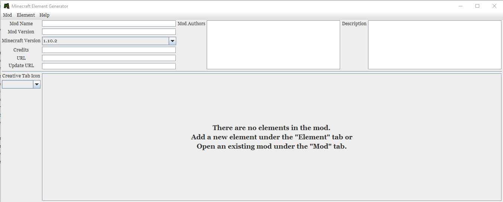
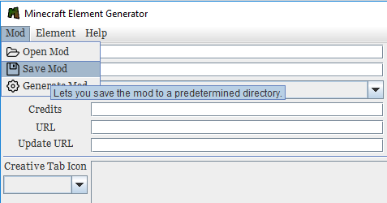
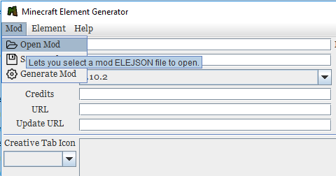
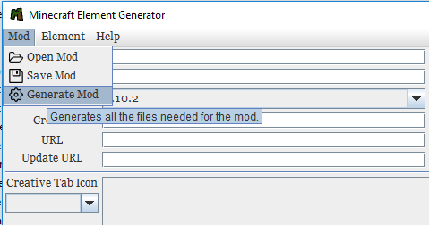
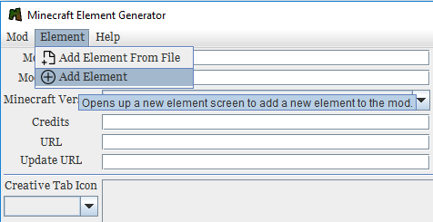
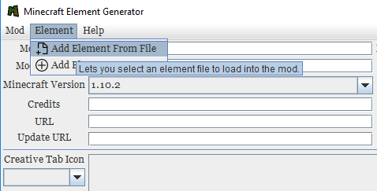

# Element Generator

## What is this?

`Element Generator` is a Java program to programmatically create, modify, save, and generated Minecraft mods for the Java edition of Minecraft.
As of right now, it only supports Minecraft versions `1.10.2` and `1.11.2`. As soon as I figure out how to programmatically generate the recipe JSON files
that were changed in version `1.12+`, then support for more recent versions will come.

Every mod you make is stored in the same directory as the `.jar` file as in. It is stored under `Saved Mods`

Every element you make is also stored in the same directory as the `.jar` file. These are stored under `Saved Elements`

NOTE: I highly recommend putting the jar file, which is available [here](https://drive.google.com/uc?export=download&id=1GBE9MqUt9FLldiQFhNMqiFham-F4ttaG) in its own folder for easy management.

## Mod

### Creating a new mod

When creating a new mod, all you have to do is load up the file. From here, you can start creating a mod that fits your needs and wants.

### Saving the mod

Once you're ready to save a mod, click on the `Mod` button on the toolbar and then click `Save Mod`

### Opening a saved mod

Each mod is stored in its own filetype with the extension `.elemod`. The file is nothing more than just a JSON file so it's easy to modify without having to load up the app.
Although it is much easier using the app.

To open a mod, simply click the `Mod` button and then click `Open Mod`. By default, it will see if you have a `Saved Mods` folder in the directory of the application.
If it does not find it, or you have a mod located in a different place, then you can navigate to it and load it from there.

### Generating a Mod

When you're ready to generate the mod, click on the `Mod` button and then click `Generate Mod`. You will be notified once the mod is finished generating.
Now here's the caveat to this generator. You *do* have to run the commands in the command prompt yourself.
However, your `src` folder and the `build.gradle` file is generated for you. So all you have to do is simply copy+paste the items 
wherever your mod is and then run the command line arguments. You can easily write a `.bat` file to run the command line arguments automatically.

## Element

### Creating a new element

To create a new element, you must simply click on the `Element` button on the toolbar and then click `Add Element`.
Then you will be sent to a screen and you can start creating your new element.

### Opening a saved element

Each element also has its own file extension `.element`. Again, it is just a JSON file.

If you downloaded an element from online or have an element file saved somewhere else, click on the `Element` button and then click `Add Element From File`.
By default, it will look for a `Saved Elements` folder in the directory of the application but you can navigate wherever you have a file saved.

## Errors

If any errors happen while generating your mod or something goes wrong, please submit an issue and provide the log file inside the `Logs` folder in the directory of the application. That would help out greatly.
